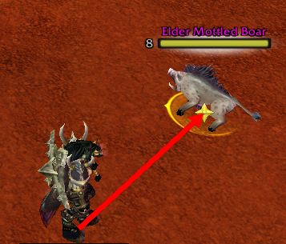

# Combat Range Finder 1.3.8

Indicators for melee and ranged combat (Turtle WoW / Vanilla 1.12).

---

Requires [SuperWoW.dll](https://github.com/balakethelock/SuperWoW) and `VanillaUtils.dll`.  
`VanillaUtils.dll` is [provided in the release zip](https://github.com/MarcelineVQ/CombatRangeFinder/releases) — load it the same way as SuperWoW (e.g. `dlls.txt` with VanillaFixes).

---

## Arrow colors

| Color | Meaning |
|-------|---------|
| **Green** | Melee range, facing target |
| **Teal** | Melee range, behind target (backstab position) |
| **Red + yellow inner** | In range but wrong facing, or obstacle blocks LoS |
| **Yellow** | Ranged / spell in range (casters) |
| **Yellow → amber → orange** | Hunter in shot range, by distance (8–18 / 18–28 / 28–36 yd) |
| **Red** | Out of range |

Arrow size does not change when you turn — only colors update.

Put a **melee instant** and/or **ranged spell** on your action bar (e.g. Sinister Strike, Auto Shot, Fireball). Range is checked via `IsActionInRange` on that slot.

---

## Class modes

| Mode | Classes | Behavior |
|------|---------|----------|
| **Ranged only** | Mage, Warlock, Priest | No melee zone — always ranged line |
| **Melee only** | Warrior, Rogue | No ranged line |
| **Hybrid** | Hunter, Shaman, Druid, Paladin | Melee + ranged; optional `/crf onlyrange` |

Hunter ranged check uses **Auto Shot** priority (not Hunter's Mark). In/out of range follows `IsActionInRange`; color bands use **2D** distance.

---

## Commands

`/crf` or `/crf help` — list options and current **class mode**

| Command | Description |
|---------|-------------|
| `enable` | Enable / disable addon |
| `arrow` | Show arrow to (attackable) target |
| `any` | Arrow for non-attackable targets too |
| `markers` | Raid markers at enemy feet |
| `markerssize` | Marker size (default 48) |
| `largearrow` | Larger arrow texture in melee when in range |
| `onlyrange` | Ranged line only (hybrid classes only) |
| `debug` | Print distance, state, spell, facing angle |

---

## Features

* Real melee range (action bar or ~5 yd)
* Ranged / spell range for casters and hunters
* Line of sight check (`UnitXP("inSight")`) — melee and ranged; obstacle → red + yellow inner
* Facing: melee **±61°**; ranged **±90°** (hunter and casters)
* Behind-target hint for melee dogpiles
* Raid markers on large mobs

---

## Changelog

### 1.3.8
* Fix arrow/markers dying after zone change: `PLAYER_LEAVING_WORLD` no longer removes `OnUpdate` (only `PLAYER_LOGOUT` does)
* Refresh screen/camera projection on `PLAYER_ENTERING_WORLD`

### 1.3.7
* LoS check in melee zone (red + yellow when blocked)

### 1.3.6
* Ranged LoS check via `UnitXP("inSight")` — in range but tree/wall → red + yellow inner
* `/crf debug` shows `los ok/blocked`

### 1.3.5
* Fix `/crf debug` crash (`FACING_HALF` nil — constants moved to top of file)
* Ranged facing **±90°** for hunter and casters; melee stays **±61°**

### 1.3.4
* Facing restored to single **±61°** cone for all classes (v1.3.0 `CONSTANT_FACING_LIMIT`); removed 59°/90° split

### 1.3.3
* Fix `/crf debug` crash (`GetFacingDelta` defined before use)
* Hunter range: trust `IsActionInRange` (removed 3D distance clamp that caused red while in shot range)
* Hunter color bands use **2D** distance (`dist2d`); debug shows `dist2d` and `dist3d`
* Hunter facing check restored: ±59° (118° firing arc); red+yellow when turned away in range

### 1.3.2
* Class modes: Mage/Warlock/Priest — ranged only; Warrior/Rogue — melee only; Hunter/Shaman/Druid/Paladin — hybrid + `/crf onlyrange`
* `/crf debug` — distance, state, spell, facing, class mode
* Hunter: Auto Shot priority (not Hunter's Mark), range clamp 8–36 yd, no facing check in ranged
* README and project docs rule

### 1.3.1
* Stable build for melee and hunters
* Yellow line uses same thin texture as red (no oversized arrow)
* Hunter distance bands: yellow → amber → orange (8–18 / 18–28 / 28–36 yd)
* Red + yellow inner arrow on wrong facing (melee and casters)
* Arrow size unchanged on turn — only colors change

### 1.3.0
* Moved to Wow AI, git repo
* Caster/hunter ranged: yellow in spell range, red out of range
* Ranged spell detection via action bar (`IsActionInRange`)

---

* Original: [MarcelineVQ/CombatRangeFinder](https://github.com/MarcelineVQ/CombatRangeFinder) by Weird Vibes (Turtle WoW)  
* Fork & enhancements: [Loogosh/CombatRangeFinder](https://github.com/Loogosh/CombatRangeFinder) — v1.3.8+
